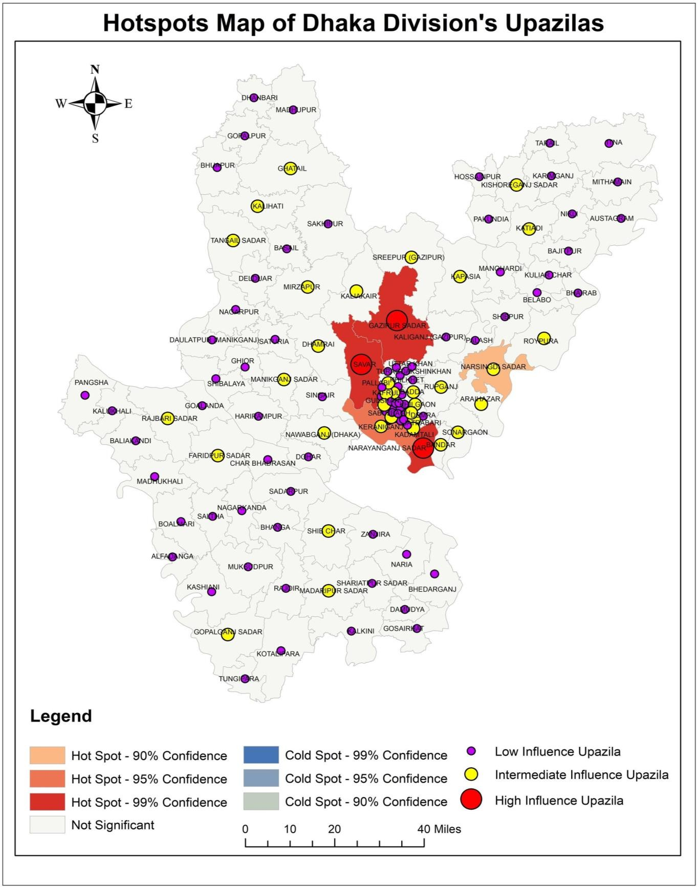
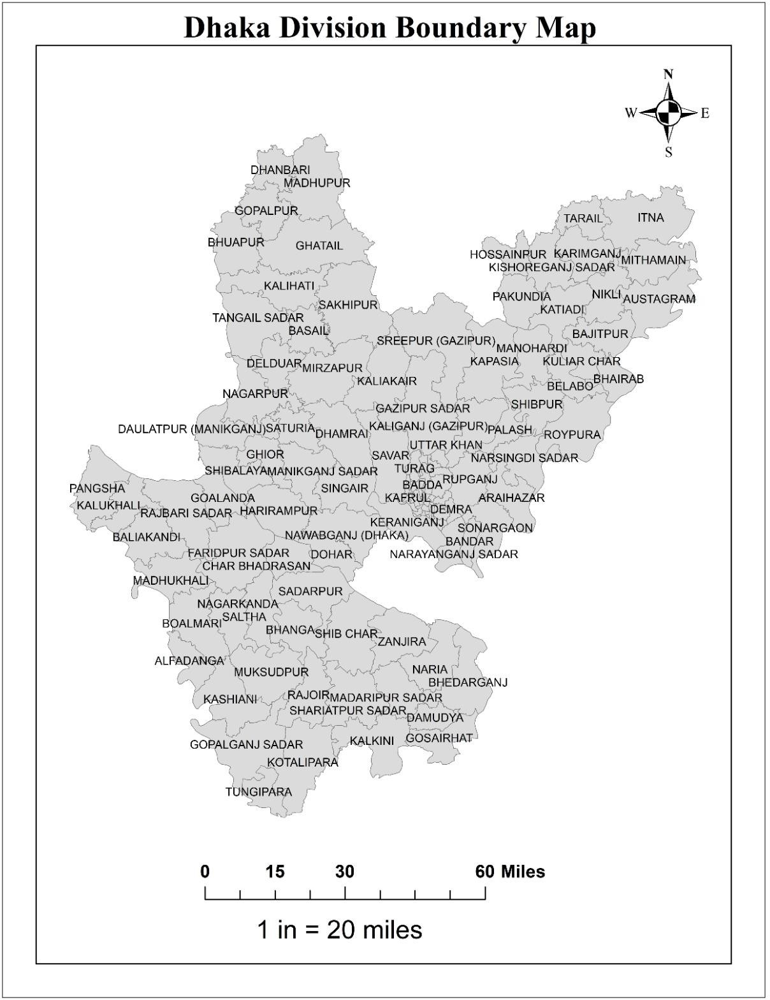
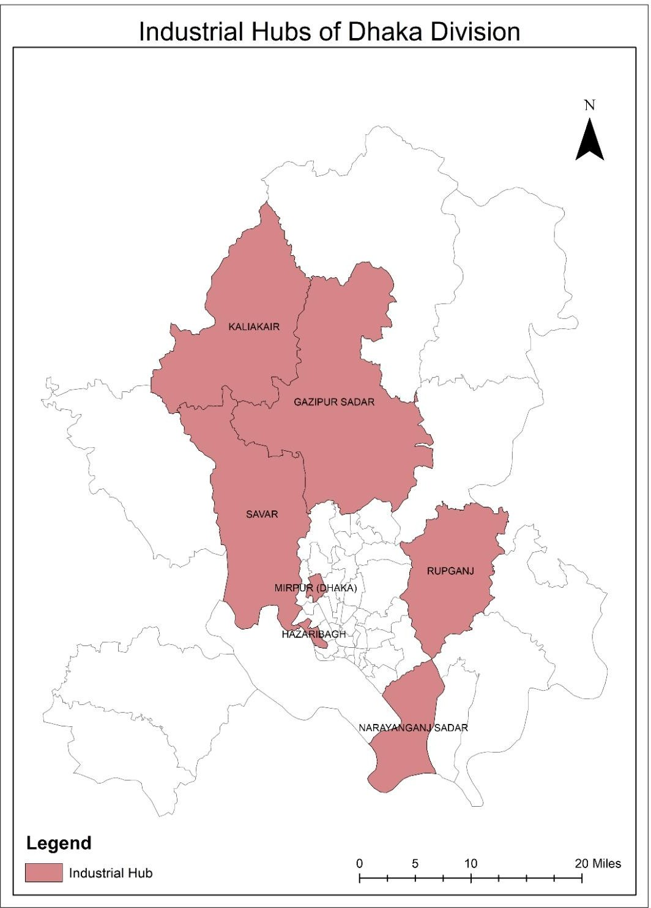
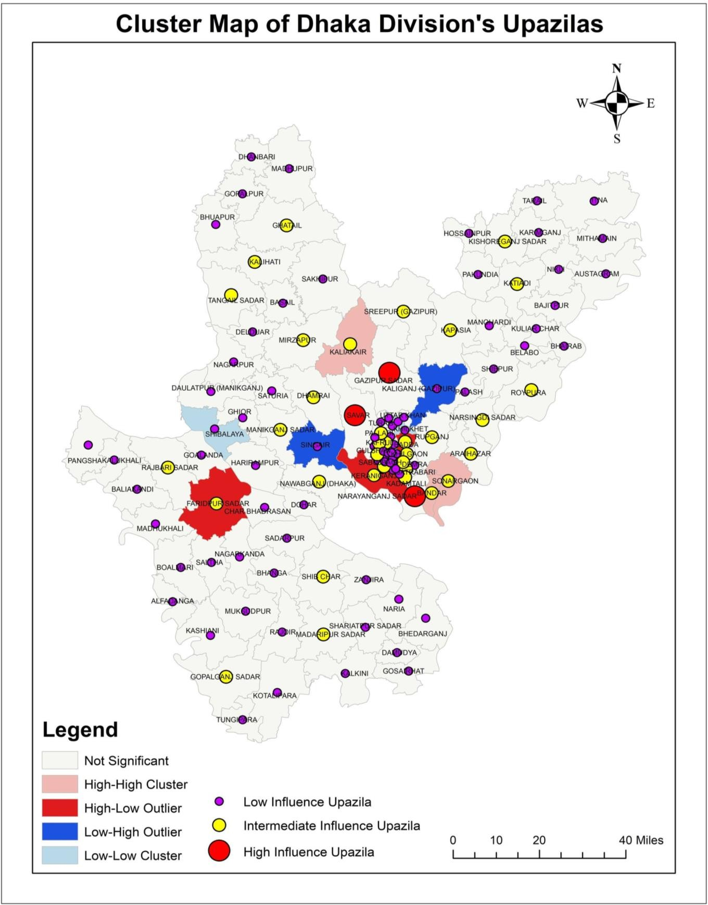
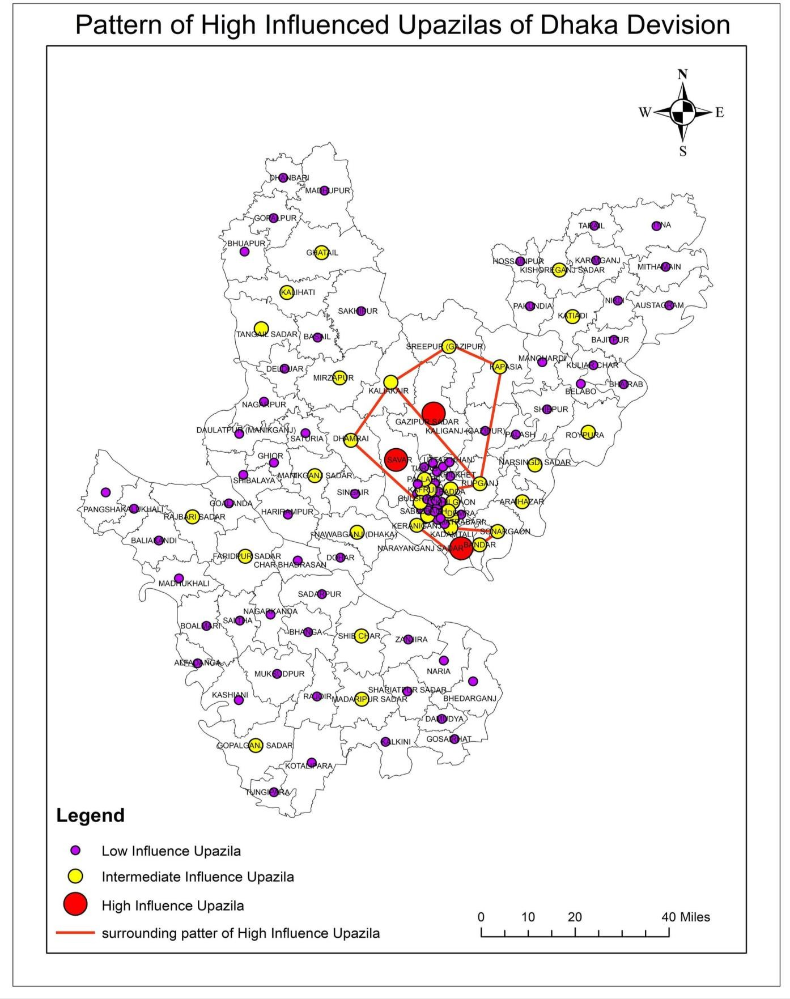

# Testing Location Theories in Dhaka Division: Hotspot, Cluster and Pattern Analysis

**Studio project, Dept. of Urban and Regional Planning, KUET** ·

## Summary

Do population and industry in Dhaka Division follow the orderly patterns that classic location theories predict? We mapped upazila population together with the division's industrial hubs. We then applied three spatial methods: hotspot analysis, Anselin Local Moran's I cluster analysis and pattern mapping. **Narayanganj Sadar, Savar and Gazipur Sadar** stand out as hotspots at 99% confidence, and all three are major textile and garment hubs. The surrounding "intermediate" upazilas form **no regular geometric pattern**. So central place theory, the sector model and production-function growth theory do not fit the observed distribution. **Growth pole theory** is the only one consistent with it.



## Study area

**Dhaka Division, Bangladesh.** The analysis unit is the upazila (sub-district).

| Upazila boundaries | Industrial hubs |
|---|---|
|  |  |

## Data

| Data | Details |
|---|---|
| Upazila population | Population per upazila, used as the driving variable |
| Upazila boundaries | Administrative boundaries of Dhaka Division |
| Industrial hubs and linkages | Leading industries and their backward linkages for Narayanganj, Gazipur Sadar and Savar (textiles, knitwear, leather), compiled from the literature |

## Method

1. Reviewed central place theory, growth pole theory, the sector model and production-function growth theory, and what each predicts about spatial order.
2. **Hotspot analysis:** found statistically significant concentrations of population at 90%, 95% and 99% confidence.
3. **Cluster analysis (Anselin Local Moran's I):** classified upazilas as high-high, high-low, low-high or low-low clusters (p < 0.05).
4. **Pattern mapping:** grouped upazilas into high, intermediate and low influence, then tested whether the intermediate areas form a regular ring or polygon around the high-influence centres.
5. Compared the results with each theory's assumptions.

## Results

- **Hotspots:** Gazipur Sadar, Savar and Narayanganj Sadar at 99% confidence, Keraniganj at 95% and Narsingdi Sadar at 90%. All other upazilas are not significant.
- **Clusters:** high-high clusters appear at Sonargaon and Kaliakair, a high-low outlier at Faridpur Sadar and Keraniganj, low-high at Singair and Kaliganj (Gazipur), and low-low at Shibalaya. Low-high and high-high clusters are concentrated in the western part of Dhaka district.
- **Pattern:** 18 intermediate-influence upazilas surround the three high-influence centres, but joining them produces no regular shape.
- **Interpretation:** growth is concentrated at a few industrial poles with uneven spread effects. That matches growth pole theory and contradicts the uniform hexagonal hierarchy of central place theory.

| Cluster map (Local Moran's I) | Pattern of high-influence upazilas |
|---|---|
|  |  |

## Tools

GIS spatial statistics: hotspot analysis, Anselin Local Moran's I (cluster and outlier analysis), pattern mapping

## Repository contents

```
images/   original maps (unchanged)
```

## Contact

Chinmoy Ghosh Shuvo · Open to collaboration and knowledge sharing. Feel free to reach out on [LinkedIn](https://www.linkedin.com/in/chinmoyghosh034).
